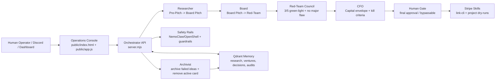

# Exit Capital Project Structure

Exit Capital is a governed venture-incubation loop: create a business candidate, enrich it, review it, red-team it, gate capital, and archive the lesson so the next cycle gets smarter.



## Runtime Flow

1. **Venture Cycle** creates a named synthetic Pre-Pitch business candidate with customer, pain, offer, funding need, risks, and kill criteria.
2. **Research** owns Pre-Pitch and promotes filled-out candidates to Board Pitch.
3. **Board Review** owns Board Pitch and promotes viable candidates to Red-Team.
4. **Red-Team Council** attacks viability, safety, legal risk, platform risk, budget realism, and missing evidence.
5. **Capital Gate / CFO** reviews the capital envelope. This still does not approve live spend.
6. **Human Gate** remains the final approval point for money, public launch, and provisioning.
7. **Archive Memory** writes failed ideas and lessons to Qdrant, then removes the card from the active board.

## Repository Map

| Path | Purpose |
| --- | --- |
| `server.mjs` | Main orchestrator API, pipeline transitions, Qdrant writes, safety checks, Stripe dry-run queue, human gate, and agent endpoints. |
| `lib/pipeline.mjs` | Tested business rules for research parsing, lane transitions, Red-Team pass/fail criteria, and archive payload generation. |
| `test/pipeline.test.mjs` | Node test suite proving the core pipeline rules without needing live model/API calls. |
| `public/index.html` | Dashboard shell and cockpit controls. |
| `public/app.js` | Frontend state rendering, lane board, card detail modal, cockpit actions, and agent light behavior. |
| `public/styles.css` | Operations-console styling and permanent cockpit layout. |
| `docs/PIPELINE_CRITERIA.md` | Criteria for moving ideas through Pre-Pitch, Board Pitch, Red-Team, Capital Gate, Live, and Killed states. |
| `guardrails/` | Safety rail configuration and recorded guardrail failure lesson. |
| `policies/` | NemoClaw/OpenShell policy artifacts for Qdrant and Stripe Link access. |
| `skills/exit-capital-handoff/` | Agent role files and operating handoff for Hermes/NemoClaw continuation. |
| `skills/stripe-link-cli/` | Stripe Link CLI skill wrapper and usage notes. |
| `skills/stripe-projects/` | Stripe project/provisioning dry-run skill notes. |
| `tools/exit_capital_guardrails.py` | Host-side guardrail helper used around risky inputs/outputs. |
| `DEMO_SCRIPT.md` | Recording script for the hackathon submission. |
| `SUBMISSION_COPY.md` | Tweet/form copy for the hackathon submission. |
| `EXIT_CAPITAL_CARRY_FORWARD.md` | Full handoff log for future operators and agents. |

## Governance Summary

Exit Capital is intentionally not a free-running money bot. Agents can propose, research, red-team, and prepare dry-run operational plans, but live spend and public launch remain behind CFO, Human Gate, Stripe controls, and NemoClaw/OpenShell safety policy.

## Testable Core

The core pipeline logic is deliberately isolated from the dashboard:

```bash
npm test
```

The tests cover:

- named business extraction from research memos
- Pre-Pitch -> Board Pitch promotion
- Board Pitch -> Red-Team promotion
- Red-Team advancement on 3/5 green-light seats with no major flaw
- Red-Team hold when a major flaw appears
- archive payloads that preserve failed-idea lessons for Qdrant
